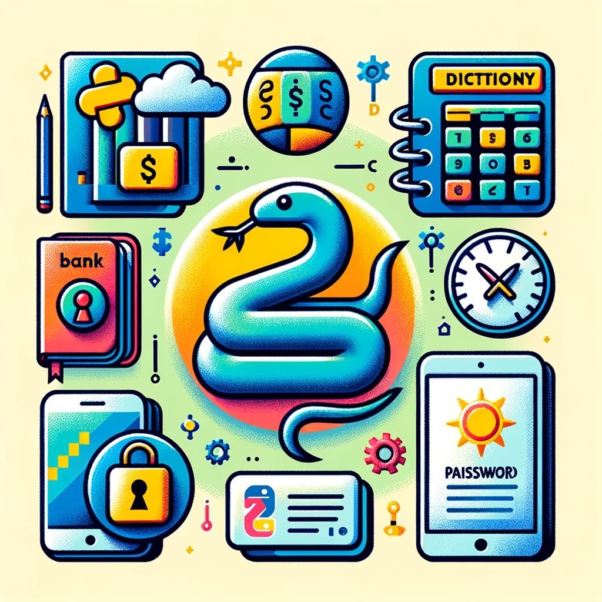

# Python Projects

Welcome to the Python Projects section! Here, you'll find a collection of practical Python projects to help you apply your programming knowledge and build useful applications. Each project is designed to reinforce specific Python skills and concepts.

</img>

## Available Projects

1. [Banking Application](Bank%20Application.md): A banking application that allows users to manage their accounts, check balances, and perform transactions securely.
2. [Dictionary Application](Dictionary%20Application.md): A simple dictionary application where users can add, list, search, and delete words along with their meanings and example sentences.
3. [Notepad Application](Notepad%20Application.md): A basic notepad application that lets users create and save text-based notes in a user-friendly interface.
4. [Password Generator](Password%20Generator.md): A password generator that creates strong and customizable passwords with various character sets and saving options.
5. [Weather Application](Weather%20Application.md): A weather application that provides real-time weather information for a specified city, including temperature, humidity, and more.
6. [To-Do List Application](To-Do-List-Application.md): A to-do list application that allows users to manage their tasks and stay organized with a command-line interface.
7. [Vehicle Rental Application](Vehicle%20Rental%20Application.md): A vehicle rental application that enables users to rent and manage vehicles, making use of a secure login system and database storage.

## How to Use

To get started with a project, navigate to its respective directory and follow the instructions provided in the project's README.md file. Each project directory contains the necessary code files and instructions for usage.

## Why These Projects?

These projects are designed to give you hands-on experience and practical insights into Python programming. By working on them, you'll not only enhance your Python skills but also create useful applications that can be applied in real-world scenarios.

## Suggested Enhancements

We hope you find these Python projects both educational and enjoyable. Happy coding!
