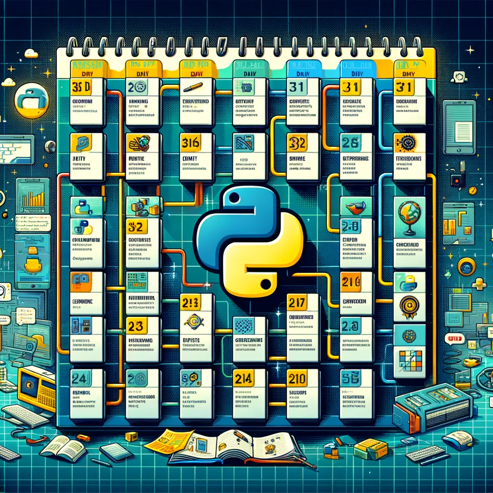

# 30-Day Python Learning Roadmap
This project provides a 30-day roadmap for learning the Python programming language. You can follow this roadmap to learn Python from scratch and grasp fundamental concepts.

## How to Use

The learning materials for each day are contained in separate files in the project's root directory. To navigate to a specific day, you can either look at the filenames or refer to the content in the main "README.md" file.

For example, to access the content for [Day 4-6](Days-4-6.md), you can check the " [Day 4-6.md](Days-4-6.md)" file.

## Content
The project is divided into the following sections:

**[Days 1-3](Days-1-3.md): Basic Concepts and Installation**
- Understand the introduction and why Python is popular.
- Learn the basic syntax of Python and its data types (string, integer, float, list, tuple, dictionary).
- Install Python on your computer.

**[Days 4-6](Days-4-6.md): Conditional Statements and Loops**
- Learn conditional statements (if, elif, else) and logical operators.
- Understand and use loops (for and while).

**[Days 7-10](Days-7-10.md): Data Structures**
- Deepen your knowledge of data structures like lists, tuples, and dictionaries.
- Practice working with data structures.

**[Days 11-14](Days-11-14.md): Functions and Modules**
- Define and use functions in Python.
- Use basic Python modules (math, random, datetime).

**[Days 15-18](Days-15-18.md): File Handling and Error Handling**
- Learn about file reading and writing.
- Understand error handling (try-except).

**[Days 19-22](Days-19-22.md): Object-Oriented Programming (OOP)**
- Understand classes and objects.
- Learn OOP concepts (inheritance, polymorphism).

**[Days 23-26](Days-23-26.md): Database Connection and SQL**
- Establish a connection with a database (e.g., SQLite).
- Learn basic SQL queries.

**[Days 27-30](Days-27-30.md): Web Development and Frameworks**
- Explore Python web frameworks like Flask or Django.
- Create a simple web application.

The content for each day is elaborated in detail within the respective day's file.

---

# 📖 My Book
- Mastering Scapy: A Comprehensive Guide to [Network Analysis](https://denizhalil.com/2023/11/12/scapy-guide-to-network-analysis-book/)

##
This roadmap will help you rapidly acquire fundamental Python skills. However, you can extend your learning time for a more in-depth understanding of Python and working on more complex projects. As you progress, you can tailor Python to your specific interests and work on more advanced projects.

## Contribution

This project is open source and we welcome contributions. If you'd like to add new learning material to the roadmap or make corrections to existing content, please submit a pull request.

## License

Python30Days is licensed under the MIT License. See the [LICENSE](LICANCE) file for details.

## Contact

- Email    : halildeniz313@gmail.com
- Linkedin : https://www.linkedin.com/in/halil-ibrahim-deniz/
- TryHackMe: https://tryhackme.com/p/halilovic
- Instagram: https://www.instagram.com/deniz.halil333/
- YouTube  : https://www.youtube.com/c/HalilDeniz
- Mysite   : https://denizhalil.com/

## 💰 You can help me by Donating
Thank you for considering supporting me! Your support enables me to dedicate more time and effort to creating useful Project like Python30Days and developing new projects. By contributing, you're not only helping me improve existing tools but also inspiring new ideas and innovations. Your support plays a vital role in the growth of this project and future endeavors. Together, let's continue building and learning. Thank you!" 
 
 

  
