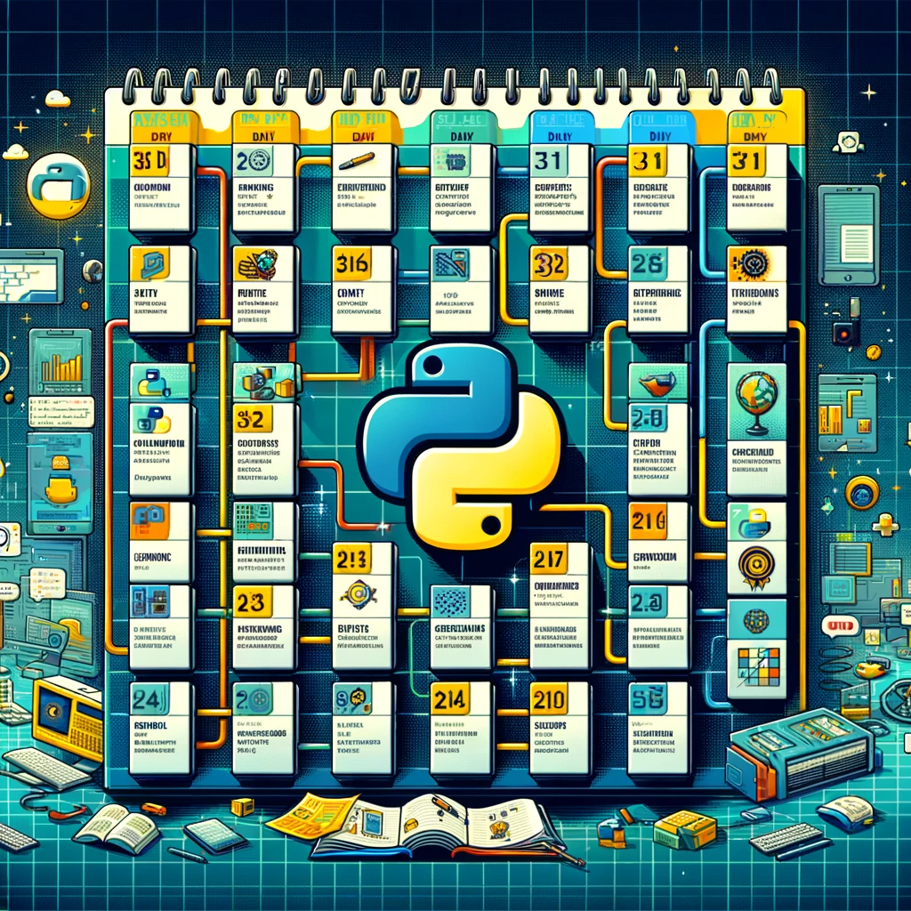

# 🚀 Python Learning Roadmap in 30 Days

Welcome to the **Python Learning Roadmap in 30 Days!** This project is designed to guide you through a structured 30-day journey to learn the Python programming language from scratch and master its fundamental concepts.

## 🌐 Socials:

 
 
 

---

## 🐍 Why Python and Why This Roadmap?

Python is a high-level, versatile programming language known for its readability and simplicity. 
It has a vast community and is widely used in various fields, including web development, data science, machine learning, automation, and more. 
This roadmap is perfect for beginners and anyone looking to solidify their Python skills.

<h4 align="center">

</h4>
---

## 🛠️ **How to Use**
The project is organized into separate sections for each day, making it easy for you to follow along. 
Each day focuses on specific topics and provides practical examples and exercises to reinforce your learning.
To navigate through the content, you can either explore the filenames or refer to the main "README.md" file. 
For instance, to access the content for [Day 4-6](30%20Days%20Essentials/Days-4-6.md), simply open the "[Day 4-6.md](30%20Days%20Essentials/Days-4-6.md)" file.

---

## 📁 Course Content

### [Days 1-3](30%20Days%20Essentials/Days-1-3.md): Basic Concepts and Installation
- Understand Python's introduction and why it's popular.
- Learn the basic syntax of Python and its core data types (string, integer, float, list, tuple, dictionary).
- Install Python on your computer.

### [Days 4-6](30%20Days%20Essentials/Days-4-6.md): Conditional Statements and Loops
- Master conditional statements (if, elif, else) and logical operators.
- Gain proficiency in using loops (for and while).

### [Days 7-10](30%20Days%20Essentials/Days-7-10.md): Data Structures
- Deepen your knowledge of data structures like lists, tuples, and dictionaries.
- Practice working with data structures through hands-on exercises.

### [Days 11-14](30%20Days%20Essentials/Days-11-14.md): Functions and Modules
- Define and utilize functions in Python.
- Explore basic Python modules (math, random, datetime).

### [Days 15-18](30%20Days%20Essentials/Days-15-18.md): File Handling and Error Handling
- Learn the art of file reading and writing.
- Master error handling techniques using try-except blocks.

### [Days 19-22](30%20Days%20Essentials/Days-19-22.md): Object-Oriented Programming (OOP)
- Understand classes and objects.
- Dive into OOP concepts, including inheritance and polymorphism.

### [Days 23-26](30%20Days%20Essentials/Days-23-26.md): Database Connection and SQL
- Establish connections with databases (e.g., SQLite).
- Learn to execute basic SQL queries for data manipulation.

### [Days 27-30](30%20Days%20Essentials/Days-27-30.md): Web Development and Frameworks
- Explore Python web frameworks like Flask and Django.
- Create a simple web application and gain insights into web development.

### [Python Projects](Projects/Readme.md)
you'll find a collection of practical Python projects to help you apply your programming knowledge and build useful applications.

* **Simple Notepad Application**
  - At the end of the day, you will develop a project to reinforce your Python learning.
  - Improve your file manipulation, user input and basic data management skills by creating a simple Notepad application
* **Dictionary Application**
  - At the end of the day, you will develop a project to reinforce your Python learning.
  - Improve your file manipulation, user input, and basic data management skills by creating a Dictionary application.
* **Random Password Generator**
  - Create a random password generator program using Python.
  - Allow users to specify password length and character set preferences.
  - Provide the option to save generated passwords to a file.
* **Bank Application**
  - A Python program that simulates basic banking operations.
  - Users can create accounts, log in, check balances, deposit and withdraw money, and transfer funds securely.
  - Enhance your Python skills, database management, and security knowledge.
* **Weather Application**
  - A Python program that provides real-time weather information for a specified city.
  - Users can input a city name and receive data such as temperature, humidity, weather description, and wind speed.
  - Enhance your Python skills, work with external APIs, and retrieve live weather data.
* **To-Do List Application**
  - A to-do list application that allows users to manage their tasks and stay organized with a command-line interface.
  - Practice creating and managing tasks, marking them as completed, and organizing your to-do list efficiently.
* **Vehicle Rental Application**
  - A vehicle rental application that enables users to rent and manage vehicles, making use of a secure login system and database storage.
  - Implement user registration, vehicle addition, rental management, and secure login features while working with a database.

## 📋 Course Structure and Preparation

Before diving into this roadmap, here's a suggested course structure:

1. **Daily Learning**: Dedicate time each day to go through the topics and complete the exercises.
2. **Hands-On Practice**: Apply what you learn by working on coding exercises and mini-projects.
3. **Revision**: Regularly review previous days' content to reinforce your knowledge.
4. **Exploration**: Beyond this roadmap, explore other Python libraries and projects that interest you.

By following this structured approach, you'll gradually build your Python proficiency and gain confidence in your programming skills.

---

## 📖 BONUS: My Book
- Python Learning Roadmap in 30 Days: [here](https://github.com/HalilDeniz/Python30Days)
- You can look here for the Practical [Posts I share.](https://www.buymeacoffee.com/halildeniz/posts)
- Mastering Scapy: A Comprehensive Guide to [Network Analysis](https://denizhalil.com/2023/11/12/scapy-guide-to-network-analysis-book/)
- Beginning Your Journey in Programming and Cybersecurity - [Navigating the Digital Future](https://www.buymeacoffee.com/halildeniz/e/191664)
- Python articles for you on our site - [Click here](https://denizhalil.com/category/python/)
- Programming articles you on our site - [Click here](https://denizhalil.com/category/programming/)
---

## 📬 How Can You Provide Feedback?
1. **Reporting a Problem:** If you encounter any bugs or issues, you can report it here. Please, the more detailed you describe the problem, the faster you will help resolve it.
2. **Ideas and Improvements:** If you have new suggestions or ideas for improving the project, you can share them here. Your community feedback is important.
3. **Share Your Projects:** You can showcase the projects or works you wrote during your Python learning journey here. Share your experiences with other learners.

---

## 🤝 Contribution

This project is open source, and we welcome contributions from the community. If you'd like to add new learning material to the roadmap or make corrections to existing content, please submit a pull request.
1. Fork the repository.
2. Create a new branch for your feature or bug fix.
3. Make your changes and commit them.
4. Push your changes to your forked repository.
5. Open a pull request in the main repository.

---

## 💰 Support the Project

If you find this project helpful, please consider supporting me. 
Your support allows me to dedicate more time and effort to creating useful projects like Python30Days and developing new tools and resources. 
By contributing, you're not only helping improve existing tools but also inspiring new ideas and innovations.
Thank you for your support! Together, let's continue building and learning.

 

Happy coding, and enjoy your Python learning journey!

---

## License

**Python Learning Roadmap in 30 Days** is licensed under the MIT License. You can find the details in the [LICENSE](LICENSE) file.
